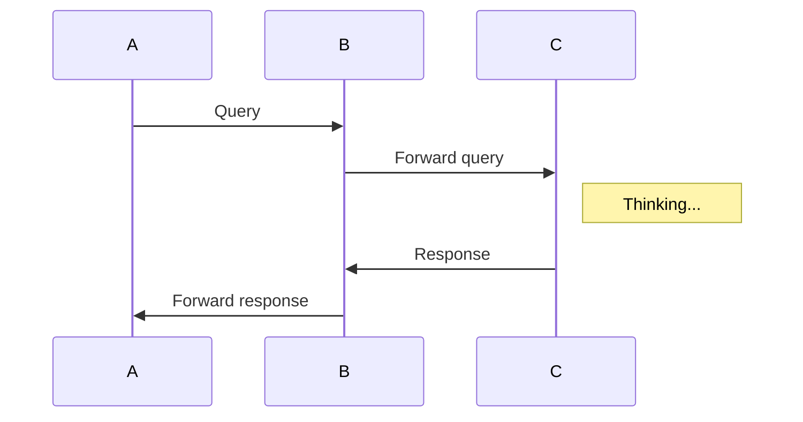

# maths

Mathematical Miscellania

* orange-idea --- Tai-Danae Bradley's [Thesis](https://arxiv.org/abs/2004.05631)

* cat-for-prog --- Bartosz Milewski's [Cat Theory for Programmers]()

* prob --- probability experiments

* algebra --- algebraic experiments

* hubbard --- Grant ubbard's [thesis](https://pdfs.semanticscholar.org/498c/57b589b4109cea874e3cd994fa646eba2be4.pdf)
